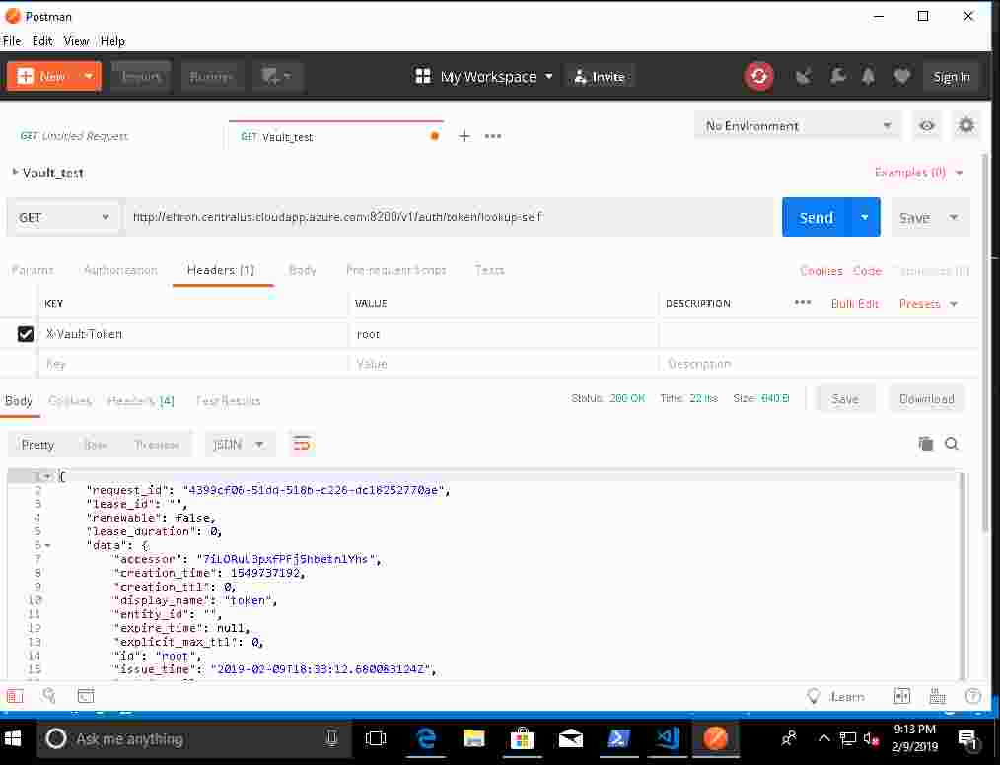

name: Azure-Terraform-Vault-Workshop
class: center,middle,title-slide
count: false

.titletext[
Azure Vault Workshop]
Modern Security With Vault

???

Welcome to the beginner's guide to Vault on Azure. 


---

name: Introductions
Introductions
-------------------------

.contents[
* Your Name
* Job Title
* Automation Experience
* Favorite Text Editor
]

???
Use this slide to introduce yourself, give a little bit of your background story, then go around the room and have all your participants introduce themselves.

The favorite text editor question is a good ice breaker, but perhaps more importantly it gives you an immediate gauge of how technical your users are.  

**There are no wrong answers to this question. Unless you say Notepad. Friends don't let friends write code in Notepad.**

**If you don't have a favorite text editor, that's okay! We've brought prebuilt cloud workstations that have Visual Studio Code already preinstalled. VSC is a free programmer's text editor for Microsoft, and it has great Terraform support. Most of this workshop will be simply copying and pasting code, so if you're not a developer don't fret. Terraform is easy to learn and fun to work with.**

---
name: Table-of-Contents
class: center,middle
Table of Contents
=========================

.contents[

0. Vault Overview
1. Our Vault Server
1. Interacting with Vault (CLI, browser, API)
1. Authorization in Vault: Policies
1. Authenticating to Vault: Auth Methods
1. Secret Management: Secret Engines
1. Example Engine One: Protecting Databases
1. Example Engine Two: Encryption as a Service
1. Vault Enterprise -- Extending Vault across the organization
]

---

name: Chapter-1
class: center,middle
.section[
Chapter 1  
Vault Overview
]

---

name: Vault-Overview
Vault Overview
-------------------------

###Vault is a __BIG__ topic!  

This is meant as a high level overview.  For detailed descriptions or instructions please see the docs, API guide, or learning site:
* https://www.vaultproject.io/docs/
* https://www.vaultproject.io/api/
* https://learn.hashicorp.com/vault/


---

name: Securing-Apps
Application Security
-------------------------


### Traditional Model
Traditional security models were built upon the idea of perimeter based security.  There would be a firewall, and inside that firewall it was assumed one was safe.  Resources such as databases were mostly static.  As such rules were based upon IP address, credentials were baked into source code or kept in a static file on disk.

* IP Address based rules
* Hardcoded credentials with problems such as:
  * Shared service accounts for apps and users
  * Difficult to rotate, decommission, and determine who has access
  * Revoking compromised credentials could break 


---

name: Securing-Apps-Vault
How Vault Secures Applications
-------------------------


###Idenity Based Model
Vault was designed to address the security needs of modern applications.  It differs from the traditional approach by using:

* Identity based rules allowing security to strecth across network perimeters
* Dyanmic, short lived credentials that are rotated frequently
* Indivual accounts to maintain provenance (tie action back to entity)
* Easily invalidate credentials or entities

---


name: Chapter-2
class: center,middle
.section[
Chapter 2
Our Vault Server
]

---

name: Our-Vault-Server-2
Our Vault Server 
-------------------------

During the Terraform Workshop we deployed a pre-configured Vault server.  That means we have already:
* Initialized the server (vault init)
  * This creates the master key used to encrypt storage
* Unsealed it
  * Vault protects the master key using a process called "unsealing"
  * One can unseal using Shamir's Secret Sharing, or auto unseal mechanisms
  * For production we strongly recommend integrating Vault with an HSM or cloud key management service like Azure Key Vault
* Retrieved the initial root token
  * When a Vault server first starts it prints the root token
  * The root token is a super user in Vault
  * In production it should be used for initial config and then destroyed
  * A root token can be regenerated at a later date if needed


---

name: Chapter-3
class: center,middle
.section[
Chapter 3
Interacting with Vault
]

---

name: Our-Vault-Server
Connecting To Our Vault Server
-------------------------

Before we begin we will connect to our Vault server so that we can run a setup script.  

Retrieve the connection instructions from Terraform:

```powershell
PS C:\Users\ehron\Desktop\azure-terraform-vault-workshop> terraform output _Instructions
#
# # Connect to your Linux Virtual Machine
# #
# # Run the command below to SSH into your server. You can also use PuTTY or any
# # other SSH client. Your password is: Password123!
#
# ssh hashicorp@ehron.centralus.cloudapp.azure.com
#
```

Next, open another Powershell window, paste in the command, and run the vault_setup.sh script when connected:
```powershell
# The password is Password123!
PS C:\...> ssh hashicorp@ehron.centralus.cloudapp.azure.com
./vault_setup.sh
```
_Note: Leave this window open as we will need this connection in future steps_

---

name: Our-Vault-Server
Connecting To Our Vault Server
-------------------------

We can interact with our newly deployed Vault server in a number of ways.  Let us connect to the web UI.

First, let us retrieve the address from Terraform by inspecting the output:
```powershell
PS C:\...> terraform output Vault_Server_url 
http://ehron.centralus.cloudapp.azure.com:8200
```


---
name: Our-Vault-Server-2
Connecting To Our Vault Server (Continued)
-------------------------

Use a web browser to connect to the address that is returned.

Log in using the token "root":
.center[]

Once logged in feel free to click around.


---

name: Our-Vault-Server-3
Connecting To Our Vault Server (Continued)
-------------------------

We can also access our Vault server from the command line.  Vault is preinstalled on your lab machine.  First, we need to tell the Vault client where the Vault server is:
```powershell
PS C:\...> $Env:VAULT_ADDR="http://<YOUR_NAME>.<REGION>.cloudapp.azure.com:8200"
PS C:\...> vault status
Key             Value
---             -----
Seal Type       shamir
Initialized     true
Sealed          false
Total Shares    1
Threshold       1
Version         1.0.1
Cluster Name    vault-cluster-4a47af87
Cluster ID      532155d5-892d-5320-80ee-297ee94bd114
HA Enabled      false
```
---

name: Our-Vault-Server-4
Authenticating To Our Vault Server
-------------------------

Let us log in.   We need to authenticate on the command line just as we did in the web UI:
```powershell
PS C:\...> vault login
Token (will be hidden):
Success! You are now authenticated. The token information displayed below
is already stored in the token helper. You do NOT need to run "vault login"
again. Future Vault requests will automatically use this token.

Key                  Value
---                  -----
token                root
token_accessor       7iLORuL3pxfPFj5hbetn1Yhs
token_duration       ∞
token_renewable      false
token_policies       ["root"]
identity_policies    []
policies             ["root"]
```

---

name: Our-Vault-Server-5
API Call To Our Vault Server
-------------------------

Finally, we can make API calls to the Vault server.  One could use something like curl or Invoke-WebRequest.  We will use Postman.  Open the Postman app and create a new request:

.center[]

---

name: Our-Vault-Server-6
API Call To Our Vault Server
-------------------------

We will create a Get request:
  * To authenticate the request create a Header named "X-Vault-Token" and set it to the value of your token (root)
  * The URL we will call is http://$USER.$REGION.cloudapp.azure.com:8200/v1/auth/token/lookup-self

Click send, and you should see some info displayed in the response that describes your token such as the path you authenticated against, the policies assigned, etc.

---
name: Our-Vault-Server-7
API Call To Our Vault Server (Results)
-------------------------

Results:

.center[]

---

name: Chapter-4
class: center,middle
.section[
Chapter 4
Authorization in Vault: Policies
]

---

name: Vault-Authorization
Authorization and Policies
-------------------------

Vault, by default, allows no access to any entity.  Administrators must explicitly grant access to consumers of the Vault service by definind policies. 

Policies express a path, and a set of "capabilities" for that path.

Example:
```hcl
# Allow tokens to look up their own properties
path "auth/token/lookup-self" {
    capabilities = ["read"]
}
```

---

name: Vault-Authorization-1
Path and Capabilities
-------------------------

The path portion literally maps to an API path.  Capabilities can include things like allowing to read, update, list, delete, create, etc.

A common pattern is for organizations to create sections of Vault for a BU or department.  Let us imagine we wanted to allow someone full control over such a section.  We could write a policy like so:
```hcl
path "lob_a/dept_1/*" {
    capabilities = ["read", "list", "create", "delete", "update"]
}
```

The above policy grants all permissions to any and all secrets mounted at "lob_a/dept_1/" by using the splat (star) operator.  

---

name: Vault-Authorization-2
Create a Policy
-------------------------

Policies are assigned when a user authenticates.  We will now create and save a policy.  We will then use it in the next section on authentication.

Our policy will limit the secrets a user can see to those under a "lob_a/workshop" path.  

Create file named policy.hcl, and put the following inside it:

```hcl
path "lob_a/workshop/*" {
    capabilities = ["read", "list", "create", "delete", "update"]
}
```

Put the following into a file called "secret.hcl"

```hcl
path "secret/*" {
    capabilities = ["read", "list", "create"]
}
```
---

name: Vault-Authorization-3
Write the Policies
-------------------------

All that is left is for us to write the policies to Vault:
```bash
# Write the policies
vault policy write lob_a lob_a_policy
vault policy write secret secret.hcl
```

We can verify that we were succesful by reading the policy endpoint:
```bash
PS C:/... > vault list sys/policy
Keys
----
default
lob_a
root
secret
```

---

name: Chapter-5
class: center,middle
.section[
Chapter 5
Authenticating to Vault: Auth Methods
]

---

name: Vault-Authentication
Auth Methods
-------------------------

There are many ways to authenticate to Vault including:
  * Approle
  * Azure/GCP/AWS/Alicloud/Etc
  * Kubernetes
  * TLS Certificates
  * ... and many more!

We covered authorization in the last chapter.  Now we will see how we tie policies to authenticated entities.

---

name: Vault-Authentication
Authentication Example: Userpass
-------------------------

An important thing to remember with authentication is that Vault is almost never the system of record.  

Instead Vault generally takes information provided by a user and validates it against an external system of record like Active Directory or cloud service metadata.

For the workshop we will use the Userpass auth method.  It is suitable for testing, but is not recommended for production.

---

name: Vault-Authentication-1
Authentication Example: Userpass (Continued)
-------------------------

Authentication methods are "mounted" to a path.  We will enable the userpass auth method now.  You should still be logged in with the root token:
```hcl
vault auth enable -path=workshop/userpass userpass
```

We have enabled our userpass auth method at the path "workshop/userpass."  We can mount as many different auth methods as we need as long as the paths for each are unique.

---

name: Vault-Authentication-1
Authentication Example: Userpass (Continued)
-------------------------

Next, let's create a couple of users:
```bash
vault write auth/workshop/userpass/users/bob \
    password=foo \
    policies=secret

vault write auth/workshop/userpass/users/sally \
    password=foo \
    policies=lob_a
```

Notice the policy section.  Policies are mapped to authentication endpoints.  Tokens generated from those endpoints have the policies assigned to it.

---

name: Vault-Authentication-2
Authentication Example: Userpass (Bob and Sally)
-------------------------

To see this in action log into the web client with both the Bob and Sally users.

.center[]

---

name: Vault-Authentication-3
Authentication Example: Userpass (Bob and Sally)
-------------------------

Do the users see the same thing?  No, because they had different policies assigned to their auth method, and therefore Bob can see the "secret" path while Sally cannot.

If you want to further investigate this you can use that same lookup-self call we made in Postman earlier.

.center[]

---

name: Chapter-6
class: center,middle
.section[
Chapter 6
Example Engine One: Protecting Databases
]

---

name: Database-Engine
Dynamic Secrets: Protecting Databases
-------------------------

Can you believe we have made it this far without talking about Dynamic Secrets?  Me either!

Just like with authentication Vault has many different Secret Engines such as:
  * Dynamic Database Credentials
  * PKI/TLS cert generation
  * Azure/GCP/AWS/Alicloud/etc accounts
  * and so much more!

See the docs for more information:
https://www.vaultproject.io/docs/secrets/

---

name: Database-Engine
Dynamic Secrets: Roles
-------------------------

Vault adminstrators enable a secret engine, and then create "roles" that describe a set of capabilities.  Multiple roles for the same engine can exist.

For example, you could have a read-only role, and a read-write role for the same database.  You control access to the roles through policies.

---

name: Database-Engine-1
Dynamic Secrets: Enable and Create Role
-------------------------

We will now enable the database secret engine, and create a couple of roles

The following commands should be run on the Vault server:
```bash
vault write lob_a/workshop/database/roles/workshop-app-long \
    db_name=wsmysqldatabase \
    creation_statements="CREATE USER '{{name}}'@'%' IDENTIFIED BY '{{password}}';GRANT ALL ON *.* TO '{{name}}'@'%';" \
    default_ttl="1h" \
    max_ttl="24h"

vault write lob_a/workshop/database/roles/workshop-app \
    db_name=wsmysqldatabase \
    creation_statements="CREATE USER '{{name}}'@'%' IDENTIFIED BY '{{password}}';GRANT ALL ON *.* TO '{{name}}'@'%';" \
    default_ttl="5m" \
    max_ttl="1h"

```

---

name: Database-Engine-2
Dynamic Secrets: Database
-------------------------

There was a lot going on in the last slide.  We specified a number of things:
  * The path someone would call: "lob_a/workshop/database"
  * The name of the database the role can interact with: wsmysqldatabase
  * The creation statement that defines the capabilities of the user that is created
  * The default time to live.  One role specified an hour, and the other 5 minutes
  * The maximum duration for a generated account; 24 hours and 1 hour respectively

---

name: Database-Engine-3
Dynamic Secrets: Retrieve an account
-------------------------

Now that we have configured the secret engine let us use it to retrieve an account!  In production you would create a policy scoped to this path.  In the interest of time we will just log back in as root.  Execute the following commands from your SSH connection to the Vault server:
```bash
hashicorp@ehron:~$ vault login root
hashicorp@ehron:~$ vault read lob_a/workshop/database/creds/workshop-app
Key                Value
---                -----
lease_id           lob_a/workshop/database/creds/workshop-app/7iGbAFpSiq8VXkpzuvqVESiy
lease_duration     5m
lease_renewable    true
password           A1a-6piezZFGBDzplwUb
username           v-token-workshop-a-787SbPtZgozJ4
```

Voila!  We have database creds!

---

name: Database-Engine-4
Dynamic Secrets: veriify account
-------------------------

We can verify the creds by using them to log in to the Azure Mysql database:
```bash
hashicorp@ehron:$ mysql -h ehron-mysql-server.mysql.database.azure.com -u v-token-workshop-a-4Jt0c81skKnkj@ehron-mysql-server -pA1a-29dUv0Vcp9bkJ063
Welcome to the MariaDB monitor.  Commands end with ; or \g.
Your MySQL connection id is 65281
Server version: 5.6.39.0 MySQL Community Server (GPL)

Copyright (c) 2000, 2018, Oracle, MariaDB Corporation Ab and others.

Type 'help;' or '\h' for help. Type '\c' to clear the current input statement.

MySQL [(none)]> 
...
```

_The above command is tricky.  No spaces between -p and password are allowed, and the username format is quite odd.  Cutting and pasting where possible is ideal..._


---

name: Database-Engine-5
Dynamic Secrets: Wrapping up
-------------------------

As you can see retrieving dynamic credentials is straightforward.  We do not need to manually clean up the account.  It will disappear when the lease expires!

.center[]

---

name: Chapter-8
class: center,middle
.section[
Chapter 8  
Example Engine Two: Encryption as a Service
]

---

name: Encryption-as-a-Service
Encryption as a Service: Immense Value Delivered
-------------------------

The last thing we'll touch on today is probably the most valuable feature Vault has to offer.  Using Vault's transit engine, or Encryption as a Service, can keep your company out of the news.

EEAS has many benefits:
  * Centralized key management
  * Automated key rotation and rewrapping
  * Ensuring only approved encryption algorithms are used
  * Allowing developers to encrypt data while never giving them access to the key itself
  * Audit trail for both access and operational tasks like rotation
  * And more...

---

name: Encryption-as-a-Service-1
Encryption as a Service: Example Application
-------------------------

We will demonstrate EEAS with an example application hosted on the Vault server.  We need to make some config file changes, and start the application.  Using our SSH connection:
```bash
hashicorp@ehron:~$ cd transit-app-example/backend/
hashicorp@ehron:~/transit-app-example/backend$ nano/vim config.ini 
```

---

name: Encryption-as-a-Service-2
Encryption as a Service: Example Application (Continued)
-------------------------

We need to make some changes to the config file.  In the Database section update the Address, User, and Password sections.  In the Vault section change Enabled to False:
```bash
[DEFAULT]
LogLevel = DEBUG # Change this to debug if you wish

[DATABASE]
#Address=localhost
Address=ehron-mysql-server.mysql.database.azure.com
Port=3306
#User=root
User=hashicorp@ehron-mysql-server
#Password=root
Password=Password123!
Database=my_app

[VAULT]
#Enabled = True
Enabled = False
DynamicDBCreds = False
...
```

---

name: Encryption-as-a-Service-3
Encryption as a Service: Example Application (Continued)
-------------------------

Once you have saved the changes to the config file you can start the application.
```bash
hashicorp@ehron:~/transit-app-example/backend$ python3 app.py
```

---


name: Encryption-as-a-Service-1
Encryption as a Service: Example Application
-------------------------

Open a browser, and navigate to the address of your Vault server while specifying port 5000.

Example:
.center[]

---

name: Encryption-as-a-Service-2
Encryption as a Service: Example Application (Continued)
-------------------------

There are two main sections in the application.
1. Records View
  * The records view displays records in plain text
  * This view represents what a human customer service rep may see, or the data needed by an order processing system
1. Database View
  * This view shows the records in the database (so we don't have to have multiple terminals open)
  * It is the equivalent of "SELECT * FROM `users`"
